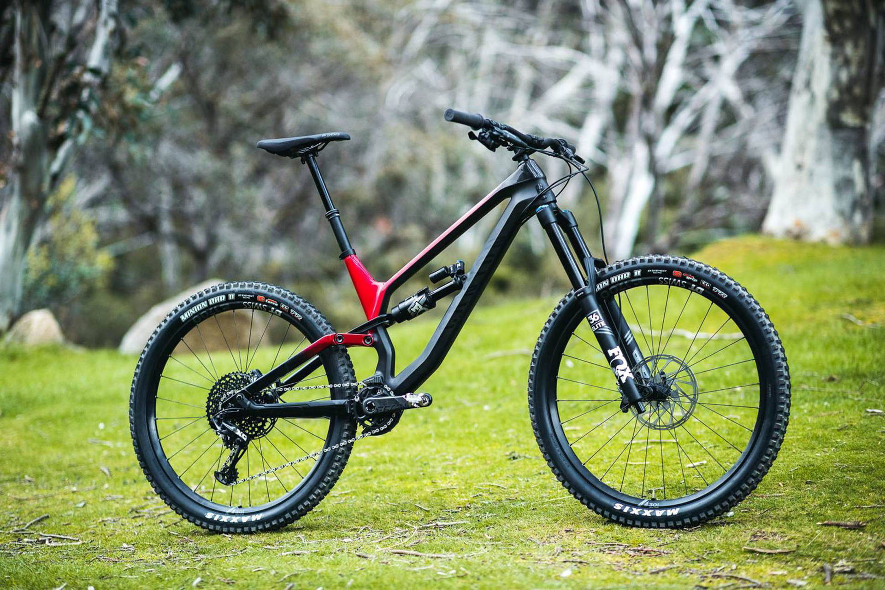
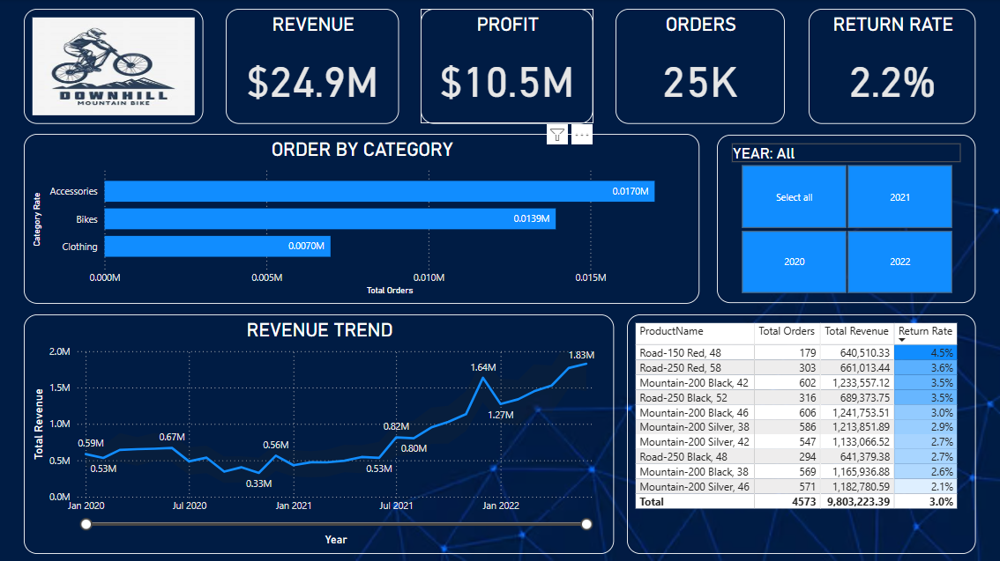

# Bicycle Sales Dashboard

&nbsp;

## Overview

This Power BI dashboard provides comprehensive insights into the sales performance of a bicycle business. It visualizes data related to revenue, profit, orders, and return rates, enabling data-driven decisions. The dashboard includes interactive visuals and filters for enhanced user experience.

## Tool used :
&nbsp;

## Key Metrics

Revenue: $24.9M

Profit: $10.5M

Total Orders: 25K

Return Rate: 2.2%

## Features

Orders by Category: Displays total orders for Accessories, Bikes, and Clothing.

Product Details Table: Provides insights into individual product performance, including:

  Total Orders

  Total Revenue

  Return Rate

Revenue Trend: Tracks total revenue across the timeline from January 2020 to June 2022.

Date Filter: Interactive date range selector to filter data based on specific time periods.

Revenue Forecast Insight: Displays actual vs expected revenue values with min and max estimates for performance evaluation.

## Visual Breakdown

### Top Section

Revenue, Profit, Orders, and Return Rate: Highlights key KPIs for quick insights.

Orders by Category: Visualizes order distribution across major product categories.

### Middle Section

Product Details Table: Lists product-wise performance data with return rate indicators.

### Bottom Section

Revenue Trend Graph: Displays revenue trends over time with key points highlighted for better analysis.

## Usage

Clone this repository.

Open the Power BI file (.pbix) in Power BI Desktop.

Connect to your data source if required.

Interact with the dashboard to analyze performance metrics.

## Data Insights

The Accessories category has the highest number of orders (17K).

The Bikes category shows strong revenue performance despite fewer orders than Accessories.

The Revenue Trend shows consistent growth, with notable peaks around Jan 2022 and later months.

The Revenue Forecast Insight provides a useful comparison of actual revenue against expected values to identify trends and anomalies.

## Future Enhancements

Add drill-through features for deeper analysis.

Introduce additional KPIs such as Customer Lifetime Value (CLV).

Improve visual design with enhanced themes.

## Dashboard :
&nbsp;
